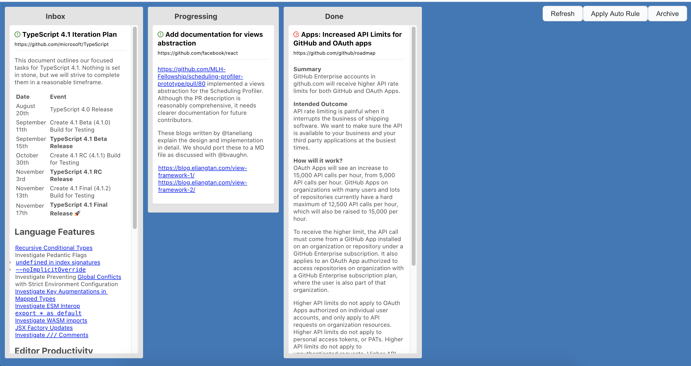

# My-Board-For-Github(MYFG)

GitHub Project Board to handle across all repositories!

- GitHub's [user-owned project board](https://docs.github.com/en/github/managing-your-work-on-github/creating-a-project-board#creating-a-user-owned-project-board) limit repositories
- GitHub Repository/Organization Project board does not treat outside of the repository and organization.
- My-Board-For-Github(MYFG) can treat all repositories if you can access

My-Board-For-Github(MYFG) can also treat non-own project's issue and pull request.
MYFG just require GitHub's issue/pr url for handling in the project board.



## Usage

1. Create your My-Board-For-Github(MYFG) data repository
    - e.g. `example-owner/my-board-data`
2. Create `project.json` into data repository
    - e.g. [project.json](https://github.com/azu/my-board-for-github-example/blob/master/project.json)
    - For more details about the schema, see [src/data/DataScheme.ts](src/data/DataScheme.ts)
    - `inbox` and `done` id is special meaning
2. [Create Personal AccessToken for your GitHub Account](https://docs.github.com/en/github/authenticating-to-github/creating-a-personal-access-token)
    - require: `repo` scope
3. Access My-Board-For-Github(MYFG)

- `https://my-board-for-github.netlify.app/?owner=<owner>&repo=<repo>&branch=<branch>&token=<token>`

Parameters:

- `owner`: owner name of data repository
    - `example-owner`
- `repo`: repo name of data repository
    - `my-board-data`
- `branch`: branch name of data repository
    - `master"`
- `token`: GitHub Access Token for MYFG
    - `xxxx`
    
### `project.json` format

Data repository require a `project.json` file under the root directory.
`project.json` schema is defined in [src/data/DataScheme.ts](src/data/DataScheme.ts).

```json
[
  {
    "id": "inbox",
    "title": "Inbox",
    "items": [
      {
        "url": "https://github.com/facebook/react/issues/19670",
        "type": "issue"
      },
      {
        "url": "https://github.com/microsoft/TypeScript/issues/40124",
        "type": "issue"
      }
    ]
  },
  {
    "id": "progressing",
    "title": "Progressing",
    "items": [
    ]
  },
  {
    "id": "done",
    "title": "Done",
    "items": [
      {
        "url": "https://github.com/github/roadmap/issues/65",
        "type": "issue"
      },
      {
        "url": "https://github.com/github/opensource.guide/pull/1704",
        "type": "pull_request"
      }
    ]
  }
]
```

### Examples

Visit example board:

Require your GitHub Access Token, because GraphQL API always require Access Token. 

- <https://my-board-for-github.netlify.app/?owner=azu&repo=my-board-for-github-example&branch=master&token=xxx&dryrun=true>
- Repository: [azu/my-board-for-github-example](https://github.com/azu/my-board-for-github-example)

### Add item to your project

Currently, My-Board-For-Github(MYFG) does not provide adding method yet.

Instead of it, Use [Greasemonkey script](userscript/github) for MYFG.

It allows you to add issue and pull request to your project from GitHub directly.

For more details, see [userscript/github](userscript/github).

## Contributing

1. Fork it!
2. Create your feature branch: `git checkout -b my-new-feature`
3. Commit your changes: `git commit -am 'Add some feature'`
4. Push to the branch: `git push origin my-new-feature`
5. Submit a pull request :D

## License

MIT

## OSS Sponsors
          
<a href="https://www.netlify.com">

</a>
            

---

## Development

This project was bootstrapped with [Create React App](https://github.com/facebook/create-react-app).

## Available Scripts

In the project directory, you can run:

### `yarn start`

Runs the app in the development mode.<br />
Open [http://localhost:3000](http://localhost:3000) to view it in the browser.

The page will reload if you make edits.<br />
You will also see any lint errors in the console.

### `yarn test`

Launches the test runner in the interactive watch mode.<br />
See the section about [running tests](https://facebook.github.io/create-react-app/docs/running-tests) for more information.

### `yarn build`

Builds the app for production to the `build` folder.<br />
It correctly bundles React in production mode and optimizes the build for the best performance.

The build is minified and the filenames include the hashes.<br />
Your app is ready to be deployed!

See the section about [deployment](https://facebook.github.io/create-react-app/docs/deployment) for more information.

### `yarn eject`

**Note: this is a one-way operation. Once you `eject`, you can’t go back!**

If you aren’t satisfied with the build tool and configuration choices, you can `eject` at any time. This command will remove the single build dependency from your project.

Instead, it will copy all the configuration files and the transitive dependencies (webpack, Babel, ESLint, etc) right into your project so you have full control over them. All of the commands except `eject` will still work, but they will point to the copied scripts so you can tweak them. At this point you’re on your own.

You don’t have to ever use `eject`. The curated feature set is suitable for small and middle deployments, and you shouldn’t feel obligated to use this feature. However we understand that this tool wouldn’t be useful if you couldn’t customize it when you are ready for it.

## Learn More

You can learn more in the [Create React App documentation](https://facebook.github.io/create-react-app/docs/getting-started).

To learn React, check out the [React documentation](https://reactjs.org/).
